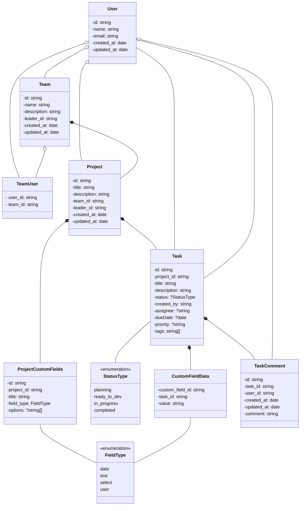
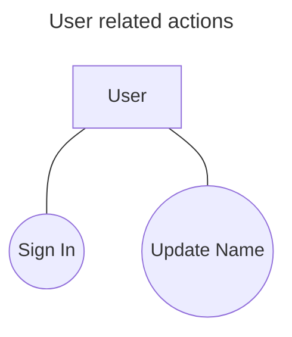
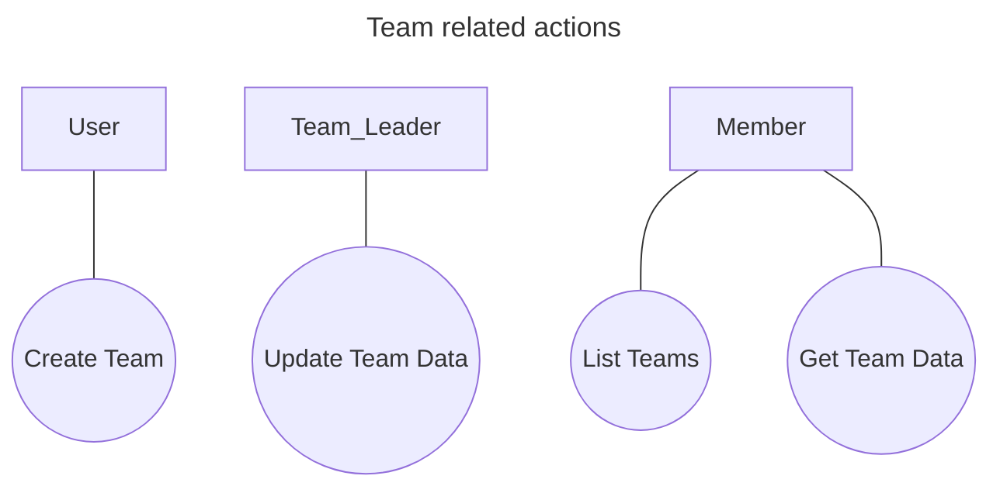
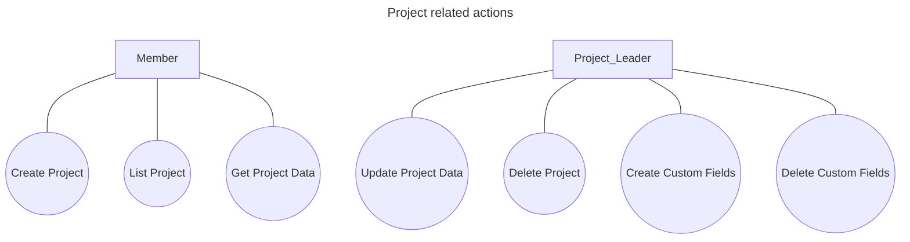
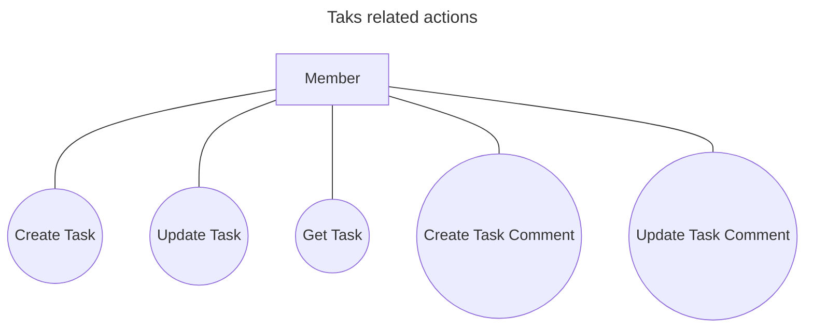

### UML

```mermaid
classDiagram
  class User {
    -id: string
    -name: string
    -email: string
    -created_at: date
    -updated_at: date
  }
  class Team {
    -id: string
    -name: string
    -description: string
    -leader_id: string
    -created_at: date
    -updated_at: date
  }
  class TeamUser {
    - user_id: string
    - team_id: string
  }

  User o-- Team
  User o-- TeamUser
  Team o-- TeamUser

  class Project {
    -id: string
    -title: string
    -description: string
    -team_id: string
    -leader_id: string
    -created_at: date
    -updated_at: date
  }

  User o-- Project
  Team *-- Project

  class FieldType {
    <<enumeration>>
    date
    text
    select
    user
  }

  class ProjectCustomFields {
    -id: string
    -project_id: string
    -title: string
    -field_type: FieldType
    -options: ?string[]
  }

  ProjectCustomFields -- FieldType
  Project *-- ProjectCustomFields

  class StatusType {
    <<enumeration>>
    planning
    ready_to_dev
    in_progress
    completed
  }

  class Task {
    -id: string
    -project_id: string
    -title: string
    -description: string
    -status: ?StatusType
    -created_by: string
    -assignee: ?string
    -dueDate: ?date
    -priority: ?string
    -tags: string[]
  }

  Project *-- Task
  User -- Task
  Task -- StatusType

  class CustomFieldData {
    -custom_field_id: string
    -task_id: string
    -value: string
  }

  Task *-- CustomFieldData
  CustomFieldData -- FieldType

  User -- Task

  class TaskComment {
    -id: string
    -task_id: string
    -user_id: string
    -created_at: date
    -updated_at: date
    -comment: string
  }

  Task *-- TaskComment
  User o-- TaskComment

```

```mermaid
---
title: User related actions
---
flowchart TD
    User --- SI((Sign In))
    User --- UN((Update Name))
```

```mermaid
---
title: Team related actions
---
flowchart TD
    User --- CTM((Create Team))
    Team_Leader --- UTM((Update Team Data))
    Member --- LTM((List Teams))
    Member --- GTM((Get Team Data))
```

```mermaid
---
title: Project related actions
---
flowchart TD
    Member --- CP((Create Project))
    Member --- LP((List Project))
    Member --- GP((Get Project Data))
    Project_Leader --- UP((Update Project Data))
    Project_Leader --- DP((Delete Project))
    Project_Leader --- CCF((Create Custom Fields))
    Project_Leader --- DCF((Delete Custom Fields))
```

```mermaid
---
title: Taks related actions
---
flowchart TD
    Member --- CT((Create Task))
    Member --- UT((Update Task))
    Member --- GT((Get Task))
    Member --- CTC((Create Task Comment))
    Member --- UTC((Update Task Comment))
```
