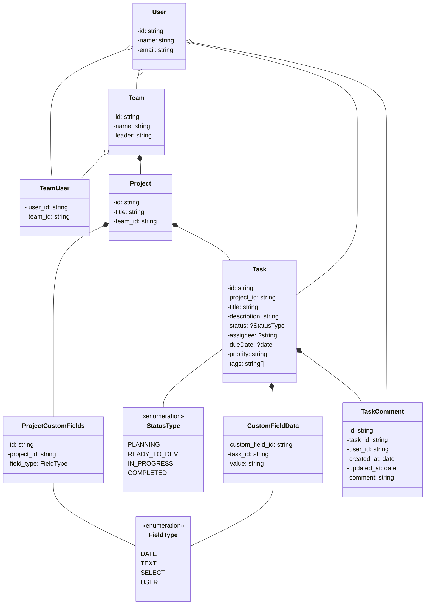
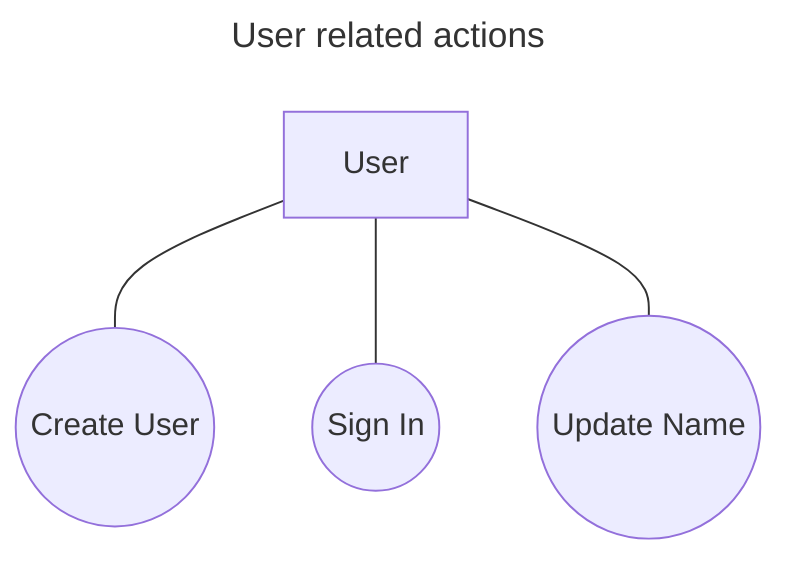
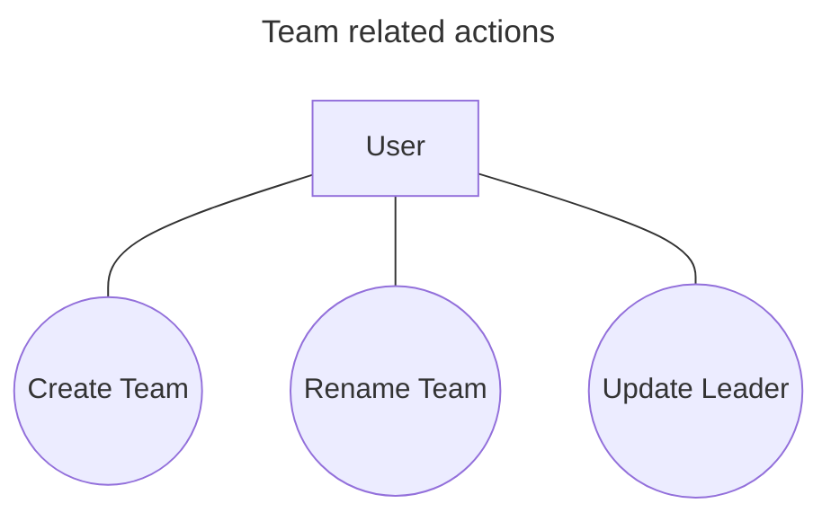
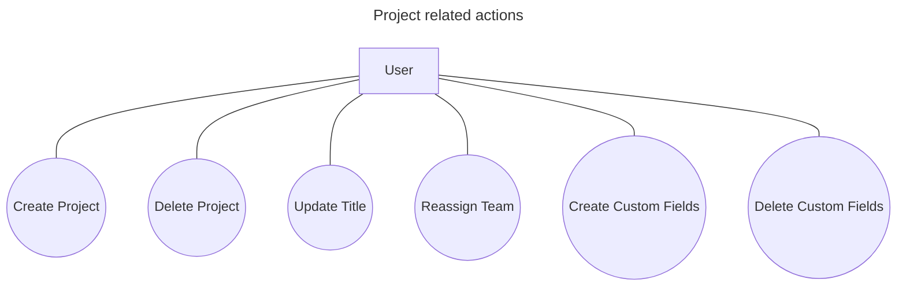
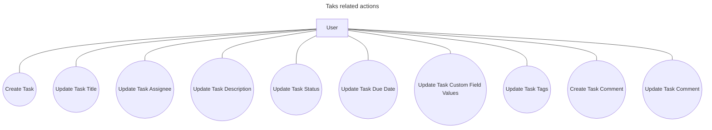

### UML

```mermaid
classDiagram
  class User {
    -id: string
    -name: string
    -email: string
  }
  class Team {
    -id: string
    -name: string
    -leader: string
  }
  class TeamUser {
    - user_id: string
    - team_id: string
  }

  User o-- Team
  User o-- TeamUser
  Team o-- TeamUser

  class Project {
    -id: string
    -title: string
    -team_id: string
  }

  Team *-- Project

  class FieldType {
    <<enumeration>>
    DATE
    TEXT
    SELECT
    USER
  }

  class ProjectCustomFields {
    -id: string
    -project_id: string
    -field_type: FieldType
  }

  ProjectCustomFields -- FieldType
  Project *-- ProjectCustomFields


  class StatusType {
    <<enumeration>>
    PLANNING
    READY_TO_DEV
    IN_PROGRESS
    COMPLETED
  }

  class Task {
    -id: string
    -project_id: string
    -title: string
    -description: string
    -status: ?StatusType
    -assignee: ?string
    -dueDate: ?date
    -priority: string
    -tags: string[]
  }

  Project *-- Task
  Task -- StatusType

  class CustomFieldData {
    -custom_field_id: string
    -task_id: string
    -value: string
  }

  Task *-- CustomFieldData
  CustomFieldData -- FieldType

  User -- Task

  class TaskComment {
    -id: string
    -task_id: string
    -user_id: string
    -created_at: date
    -updated_at: date
    -comment: string
  }

  Task *-- TaskComment
  User o-- TaskComment

```

```mermaid
---
title: User related actions
---
flowchart TD
    User---CU((Create User))
    User---SI((Sign In))
    User---UN((Update Name))
```

```mermaid
---
title: Team related actions
---
flowchart TD
    User---CTM((Create Team))
    User---RTM((Rename Team))
    User---UTL((Update Leader))
```

```mermaid
---
title: Project related actions
---
flowchart TD
    User --- CP((Create Project))
    User --- DP((Delete Project))
    User --- UPT((Update Title))
    User --- RSTM((Reassign Team))
    User --- CCF((Create Custom Fields))
    User --- DCF((Delete Custom Fields))
```

```mermaid
---
title: Taks related actions
---
flowchart TD
    User --- CT((Create Task))
    User --- UTT((Update Task Title))
    User --- UTAS((Update Task Assignee))
    User --- UTD((Update Task Description))
    User --- UTS((Update Task Status))
    User --- UTDL((Update Task Due Date))
    User --- UTCFV((Update Task Custom Field Values))
    User --- UTTG((Update Task Tags))
    User --- CTC((Create Task Comment))
    User --- UTC((Update Task Comment))
```
