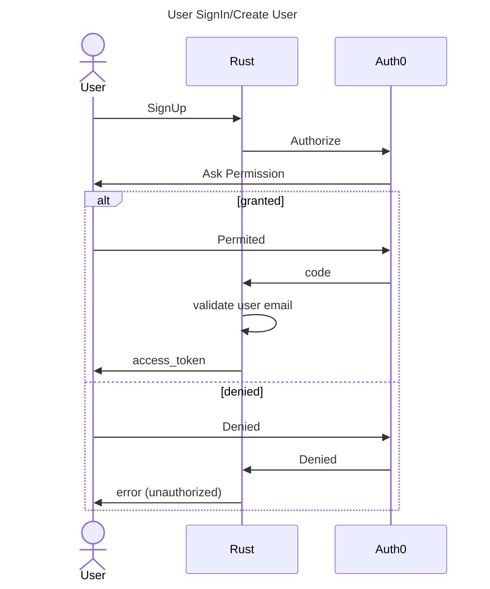
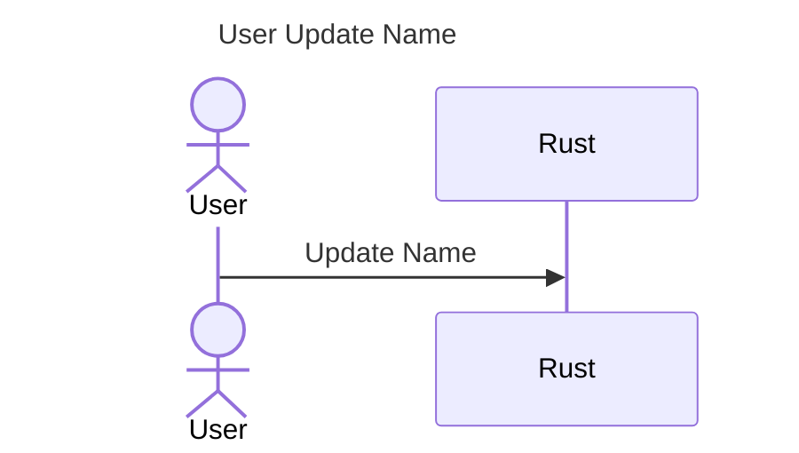

###### GET [/auth/sing-in]

- Response 201
  - Headers
    ```
      access_token: JWT token
    ```
  - Body
    ```
      {
        "access_token": string,
        "id_token": string,
        "scope": string,
        "expires_in": number,
        "token_type": "Bearer"
      }
    ```



###### Get User data [GET/me]

- Request
  - Headers
    ```
      access_token: JWT token
    ```
- Response 200

  - Body
    ```
      {
        "id": string,
        "name": string,
        "email": string
      }
    ```

###### Update User Name [GET/me]

- Request

  - Headers
    ```
      access_token: JWT token
    ```
  - Body

    ```
      {
        "name": string
      }

    ```

- Response 204


